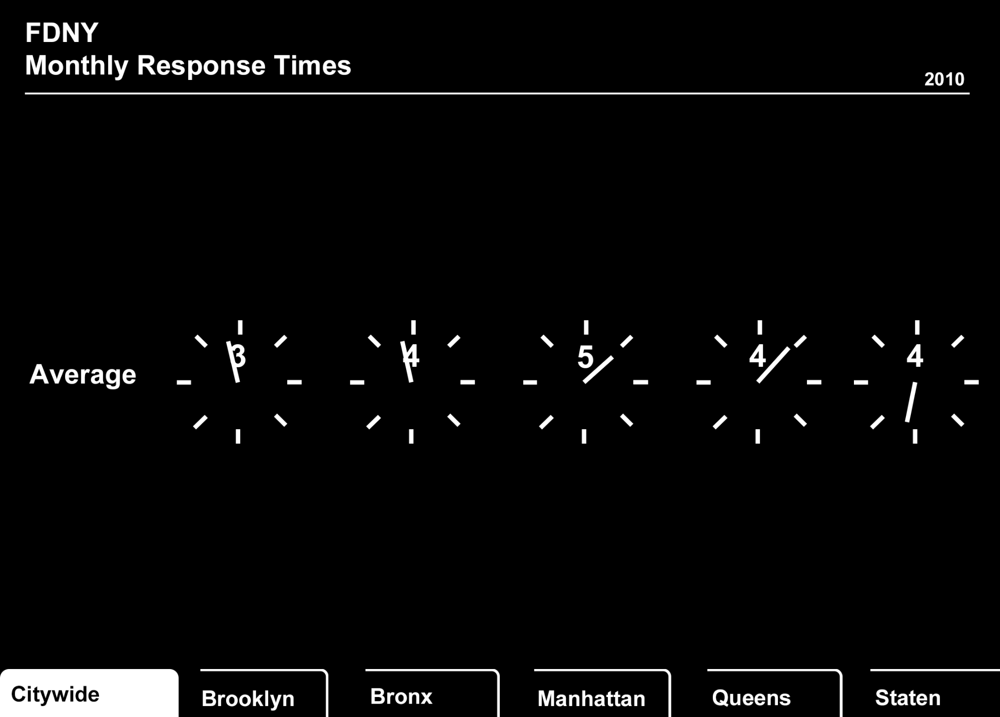
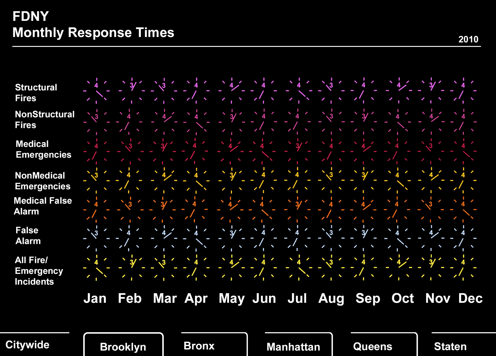

## Countdown Page - Visualizing FDNY Response Time

The data I found was the response times for the FDNY in different areas
of New York.

### As a result of briefly examining the data, I found that：

​1. Response Time is different in different areas of New York, which is
an interesting visualization point.

​2. Response Time also varies from month to month.

In order to give a realistic sense of time, I came up with the idea of
using a countdown stopwatch as the main body of this visualisation. When
the user opens the page, all the clocks will count down from the
"average time". You can see that the clocks in Brooklyn are almost
finished counting down.

And when you click on the regional menu below, you can see the response
time associated with each Incident Classification Group and Month, also
using a countdown timer.

